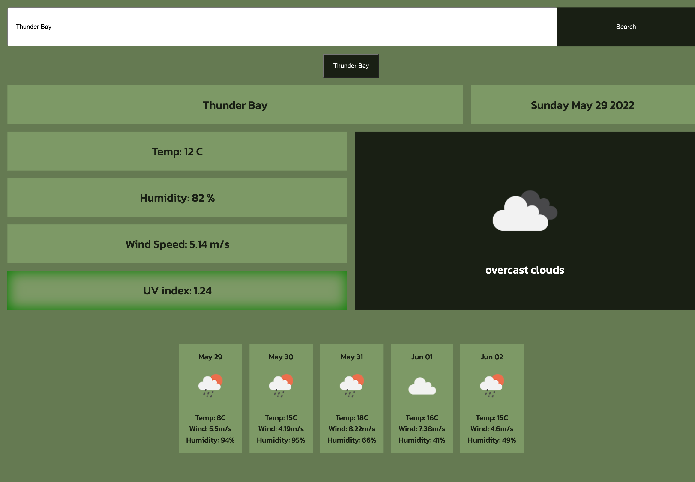
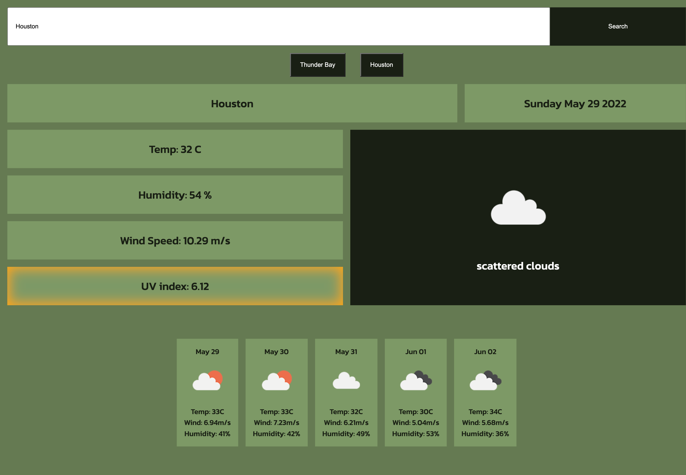
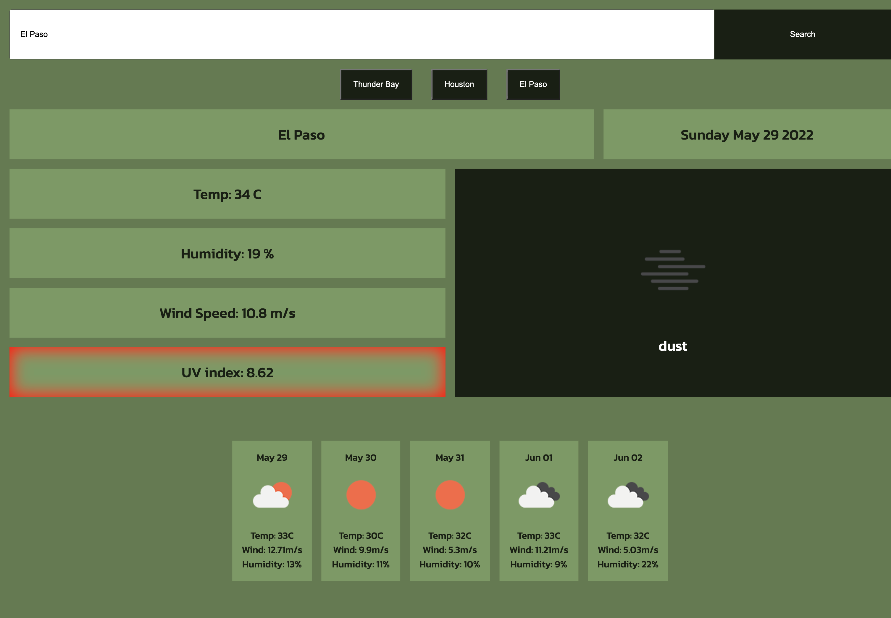

# Weather App Using OpenWeatherAPI

## This project is a dashboard to display weather data.
* Once a city is searched the UI displays temperature, humidity, wind-speed, UV Index, and an icon showing current conditions.
* The UV index shows an indicator of its intensity (low-green, medium-yellow, high-orange, very high-red, extreme-purple).
* A five day forecast is also displayed with all of the above data except UV index.
* Cities that have been searched are saved allowing users to view all recent searches.
* The data is stored in local storage to reduce the number of API calls
### This project uses JQuery, OpenWeatherAPI and DayJS

[Live Site](https://suedepritch.github.io/sunshine-rainbows/)

